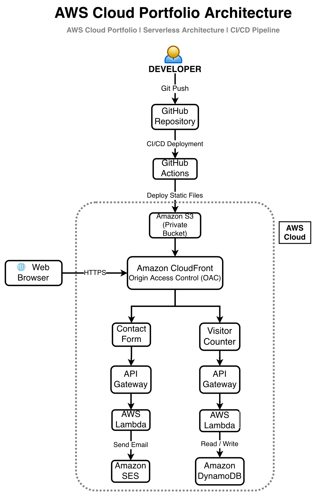

# AWS Cloud Portfolio

A modern cloud portfolio built to demonstrate practical AWS Cloud Engineering skills through real-world projects and serverless architecture.

## Live Demo

🌐 https://dip5p00fyp9mj.cloudfront.net

## GitHub Repository

💻 https://github.com/JayKamikaze/AWS-WEBSITE-PORTFOLIO

---

## Features

- Secure static website hosted on Amazon S3
- Amazon CloudFront distribution with Origin Access Control (OAC)
- HTTPS enabled
- Automated CI/CD using GitHub Actions
- Serverless visitor counter
- Serverless contact form
- Responsive design
- Custom favicon and branding

---

## AWS Services Used

- Amazon S3
- Amazon CloudFront
- IAM
- API Gateway
- AWS Lambda
- Amazon DynamoDB
- Amazon SES

---

## DevOps Tools

- Git
- GitHub
- GitHub Actions

---

## Project Architecture

### Architecture Overview

This portfolio demonstrates a modern, serverless AWS architecture designed to showcase practical Cloud Engineering skills.

#### Frontend
- Static website hosted in a private Amazon S3 bucket
- Content delivered globally through Amazon CloudFront
- Origin Access Control (OAC) secures the S3 bucket

#### Backend Services

**Visitor Counter**
- API Gateway
- AWS Lambda
- Amazon DynamoDB

**Contact Form**
- API Gateway
- AWS Lambda
- Amazon SES

#### CI/CD

Every change is automatically deployed from GitHub using GitHub Actions, providing a fully automated deployment pipeline.

### Security

- Amazon S3 bucket secured with CloudFront Origin Access Control (OAC)
- Lambda functions use least-privilege IAM policies
- Visitor Counter Lambda can only update the PortfolioVisitorCounter DynamoDB table
- Contact Form Lambda is restricted to sending email through Amazon SES
- HTTPS enabled through Amazon CloudFront
---

## Future Improvements

- Custom domain with Route 53
- Terraform Infrastructure as Code
- AWS WAF
- CloudWatch monitoring
- Unit testing
- Cost optimization

---

## Author

**Jerry Selenou**

Aspiring Cloud Engineer | AWS | DevOps | Cloud Security

- LinkedIn: https://www.linkedin.com/in/jerryselenou
- GitHub: https://github.com/JayKamikaze
